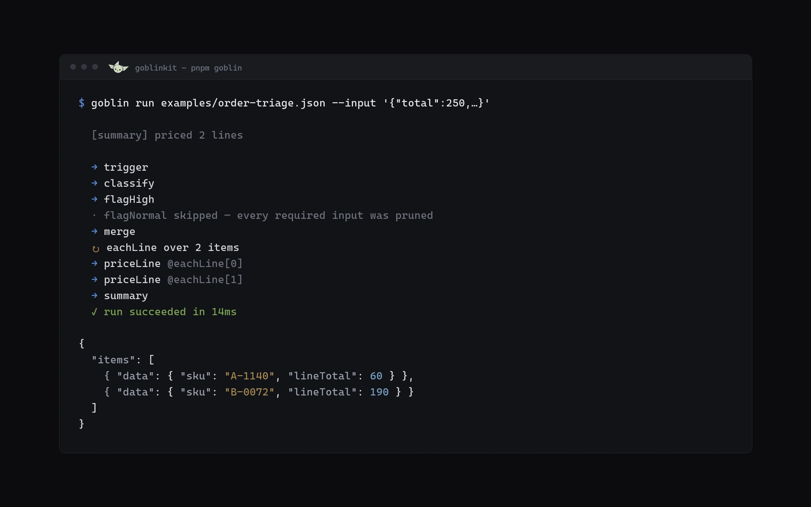
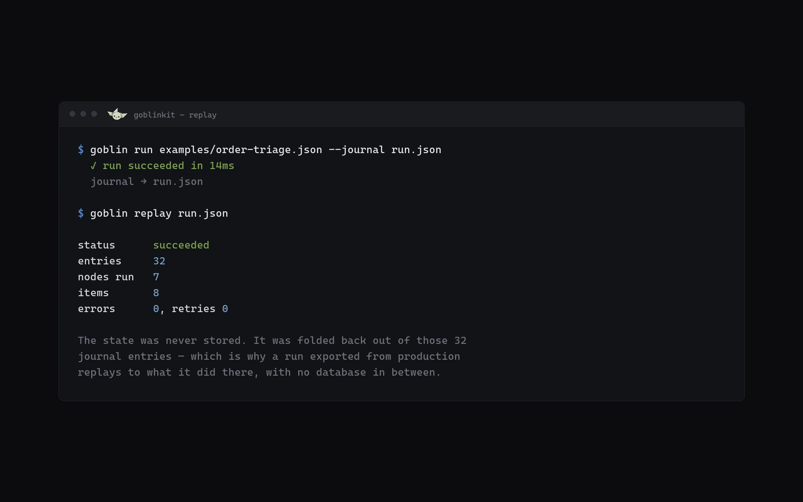

<div align="center">

# 🧌 GoblinKit

**A node-based workflow automation platform — and the reusable kit underneath it.**

Drag nodes onto a canvas, wire them together, configure them, and GoblinKit runs the result:
durably, observably, and at multi-tenant scale.

[Architecture](ARCHITECTURE.md) · [Concepts](#concepts) · [Repo layout](#repo-layout) · [Build order](#build-order)

</div>

---

## v1 — what runs today

Stage 1 of the [build order](#build-order) plus the core of Stage 2: **the kit's spine**.
A real graph — with branching, loops, retries, skips, waits and merges — executes with
no database, no queue and no UI.

```bash
pnpm install
pnpm test                                    # 46 tests
pnpm goblin run examples/order-triage.json --input '{"total":250,"lines":[{"sku":"A","qty":2,"price":30}]}'
```

<p align="center">
  
</p>

Note `@eachLine[0]` and `@eachLine[1]`: every pass through a loop is addressed
individually, so it has its own journal entries and its own inspectable output. An
engine keyed by node id alone overwrites the same record each iteration and loses the
history entirely.

Every run writes a journal, and the run's state is a fold of it — never stored,
always derived:

<p align="center">
  
</p>


| Built | Package |
|---|---|
| Document types, validation with structured diagnostics, forward-only migrations | `spec` |
| Compilation, scope matching, loop-back edge detection, scope chains, affected subgraph | `graph` |
| `advance()`, run state, journal + fold, join policies, retries, scopes, timers | `runtime` |
| `{{ }}` interpreter with no `eval` and no host access | `expressions` |
| `defineManifest` / `defineExecutor`, executor context, test harness | `node-sdk` |
| Manual trigger, Set, If, Switch, Merge, HTTP Request, Log, ForEach, While, Wait | `nodes-core` |
| Single-process driver: clock, executors, timers | `drivers-inprocess` |
| `goblin run` / `validate` / `replay` / `nodes` | `apps/cli` |

**Not built yet:** persistence and the queue driver (Stage 3), the editor (Stage 4), the
API, auth, tenancy and credentials (Stage 5). The Code node is deliberately absent until
there is a real sandbox boundary — `node:vm` is not one, and expressions cover the
common case without opening the host.

Three v1 decisions worth knowing:

- **`core.scope.*` and `core.wait` have no executor.** Looping and waiting are scheduling
  decisions, not work. A run waiting three days holds one row and no worker; a node that
  merely slept would hold a worker and lose per-iteration addressing.
- **The idempotency key excludes the attempt number.** It is stable across retries of one
  logical step, which is what stops a retried "create charge" charging twice.
- **Expressions cannot read the clock.** A workflow that did would not replay to what it
  originally did, and replay is the feature the engine is built around.

---

## What this is

Two things, deliberately kept separate:

**A product.** A web app where users build automations visually. Triggers fire, data flows along edges, nodes transform and act on it, failures retry, and every run is inspectable down to the individual item.

**A kit.** A layered set of packages where the workflow engine, graph semantics, and node SDK know nothing about *this* product. The next workflow-shaped thing you build — an AI agent builder, an ETL designer, an approval router, a CI pipeline editor — reuses the core and replaces only the node packs and the UI chrome.

> The design question behind every decision in this repo:
> **does this stay true when the node set, the UI, and the execution backend all change?**

---

## Why another one

We studied n8n, Zapier, Make, Node-RED, Temporal, Airflow, Langflow, Dify and React Flow before writing a line of design. The full findings — what we take from each and what we reject — are in [ARCHITECTURE.md §1](ARCHITECTURE.md#1-prior-art-what-we-studied-what-we-take-what-we-reject).

The short version of what GoblinKit does differently:

| | Typical approach | GoblinKit |
|---|---|---|
| **Scheduling** | An imperative loop over a mutable execution stack | A **pure reducer** — `advance(state, event) → { state, commands, journal }`. No I/O in the decision layer. |
| **Durability** | State blob updated as you go | **Append-only journal is the truth.** State is a fold. Crash recovery, replay, and time-travel debugging all fall out of one mechanism. |
| **Node definition** | UI metadata and server code in one artifact | **Manifest (data) / executor (code) split.** The browser gets JSON, never server code. |
| **Loops** | Arbitrary cycles, or none at all | **Scoped cycles** with termination bounds and per-iteration addressing. |
| **Waiting** | A worker sits blocked | `AwaitSignal` / `ScheduleTimer` — a run waiting three weeks for an approval costs one database row. |
| **Idempotency** | Each node author's problem | Platform-derived **step idempotency keys**, forwarded to upstream APIs. Retried "create charge" doesn't double-charge. |
| **User code** | `node:vm` (which is [not a sandbox](https://snyk.io/blog/security-concerns-javascript-sandbox-node-js-vm-module/)) | **QuickJS-WASM** with fuel limits — a real isolation boundary and real CPU bounds. |
| **Versioning** | Added once it hurts | `typeVersion` + migrations mandatory from node #1. |

---

## Concepts

**Workflow document** — a serializable JSON document: nodes, edges, settings. The only contract shared between editor, engine, and storage. It references no runtime type, React component, or database row.

**Node** — an instance of a node *type* at a specific *version*, with config. Declares input and output **ports**.

**Edge** — connects one output port to one input port. During a run each edge is `Pending`, `Delivered(envelope)`, or `Pruned`. Conditional branching is nothing more than pruning — the engine has no special "branch" concept.

**Envelope** — what travels an edge: an immutable list of **items**. Each item has JSON data, optional binary *references* (never inline blobs), lineage back to the items that produced it, and an optional per-item error so one bad record in a hundred doesn't fail the batch.

**Scope** — a container for iteration. Cycles are legal only back into a `ScopeStart`, which gives every loop a termination bound and makes every iteration individually addressable (`orders[3]/enrich`).

**Run** — one execution. Its journal is append-only and authoritative; its state is a fold of that journal.

**Trigger** — webhook, schedule, poll, event, or manual. All five produce the same event into one ingress, deduplicated by idempotency key before anything happens.

---

## A workflow, concretely

```jsonc
{
  "schemaVersion": 1,
  "name": "Notify on high-value signups",
  "nodes": [
    { "id": "n1", "type": "core.trigger.webhook", "typeVersion": 1,
      "config": { "path": "signup" }, "ui": { "position": { "x": 0, "y": 0 } } },

    { "id": "n2", "type": "core.http.request", "typeVersion": 2,
      "label": "Fetch account",
      "config": { "method": "GET", "url": "https://api.crm.test/a/{{ $json.accountId }}" },
      "credentials": { "httpAuth": { "id": "cred_9f2", "type": "httpAuth" } },
      "policy": { "retry": { "maxAttempts": 5, "backoff": "exponential" } },
      "ui": { "position": { "x": 240, "y": 0 } } },

    { "id": "n3", "type": "core.flow.if", "typeVersion": 1,
      "config": { "condition": "{{ $json.mrr > 1000 }}" },
      "ui": { "position": { "x": 480, "y": 0 } } },

    { "id": "n4", "type": "slack.message.send", "typeVersion": 1,
      "config": { "channel": "#sales", "text": "🐋 {{ $json.name }} — ${{ $json.mrr }}/mo" },
      "ui": { "position": { "x": 720, "y": -60 } } }
  ],
  "edges": [
    { "id": "e1", "from": { "node": "n1", "port": "main" },  "to": { "node": "n2", "port": "main" } },
    { "id": "e2", "from": { "node": "n2", "port": "main" },  "to": { "node": "n3", "port": "main" } },
    { "id": "e3", "from": { "node": "n3", "port": "true" },  "to": { "node": "n4", "port": "main" } }
  ]
}
```

Note what is **not** here: no secrets (only a `CredentialRef`), no runtime types, no UI framework. Presentation is quarantined under `ui`, so moving a node produces an obviously non-semantic diff and a headless consumer ignores it entirely.

---

## A node, concretely

Manifest and executor are separate artifacts. The manifest is data and ships to the browser; the executor is server code and never does.

```ts
// manifest.ts — pure data, browser-safe
export const manifest = defineManifest({
  type: 'slack.message.send',
  version: 1,
  title: 'Send Slack message',
  executionMode: 'perItem',
  ports: {
    inputs:  [{ id: 'main', required: true, join: 'all' }],
    outputs: [{ id: 'main' }, { id: 'error' }],
  },
  credentials: [{ type: 'slackOAuth2', required: true }],
  config: {
    schema: z.object({
      channel: expression(z.string()),
      text: expression(z.string()),
    }),
    ui: { order: ['channel', 'text'], widgets: { text: 'textarea' } },
  },
});
```

```ts
// executor.ts — server only
export const executor = defineExecutor(manifest, async (ctx) => {
  const { channel, text } = await ctx.resolveConfig();
  const auth = await ctx.credentials.get<SlackAuth>('slackOAuth2');

  const res = await ctx.http.request({          // SSRF-guarded, metered, traced
    method: 'POST',
    url: 'https://slack.com/api/chat.postMessage',
    headers: { Authorization: `Bearer ${auth.accessToken}` },
    body: { channel, text },
    signal: ctx.signal,
  });

  if (!res.ok) throw ctx.error.fromHttp(res);   // classified → retry policy applies
  return ctx.emit.main([{ data: res.json }]);
});
```

The editor renders the whole config form from `manifest` alone — no per-node UI code. The executor reaches the network only through `ctx.http`, so rate limits, egress allowlists, tracing and secret redaction are enforced by the platform rather than by node-author discipline.

---

## The core abstraction

Everything reusable in this repo follows from one function:

```ts
// Pure. No I/O, no clock, no randomness, no async.
export function advance(
  state: RunState,
  event: RunEvent,
  ctx: SchedulerContext,
): { state: RunState; commands: Command[]; journal: JournalEntry[] };
```

The engine never performs a side effect — it *describes* them. A **driver** performs them and reports back as events.

```
        ┌──────────────────── Driver (impure) ─────────────────────┐
        │   executes commands · owns clock, network, queue, DB     │
        └───────┬───────────────────────────────────▲──────────────┘
                │ commands                   events │
        ┌───────▼───────────────────────────────────┴──────────────┐
        │  advance(state, event) → { state, commands, journal }     │
        │                   pure · deterministic                    │
        └───────────────────────────────────────────────────────────┘
```

Because of this one property, all of the following are free rather than separately engineered:

- **Crash recovery** — `state = journal.reduce(apply)`. A dead worker's run is picked up by folding the journal. No bespoke recovery path.
- **Time-travel debugging** — fold to entry *k*. "State right before node X failed" is a slice, not an investigation.
- **Deterministic tests** — golden files: feed `(document, events)`, diff the command stream. Engine regressions are caught by CI, not by customers.
- **Backend portability** — in-process, queue-backed, or Temporal-backed drivers consume identical commands.
- **Replay production locally** — export a run's journal, replay it, get identical behaviour, because the decision layer has no ambient inputs.

This is Temporal's insight applied at the *step* boundary rather than the *code* boundary — durability without imposing determinism on graphs that end users author and edit mid-flight. See [ARCHITECTURE.md §7](ARCHITECTURE.md#7-the-execution-core).

---

## Repo layout

```
goblinkit/
├── packages/
│   ├── spec/                 # document types · validation · migrations         ← built, no deps
│   ├── graph/                # topo sort · cycles · scopes · affected-subgraph  ← built
│   ├── runtime/              # advance() · state · commands · events · policies  ← built, the engine
│   ├── node-sdk/             # defineManifest · defineExecutor · ctx · harness    ← built
│   ├── nodes-core/           # trigger · http · if/switch/merge · set · loops · wait ← built
│   ├── nodes-*/              # integration packs
│   ├── drivers-inprocess/    # single-process driver (tests, CLI, local dev)      ← built
│   ├── drivers-queue/        # pg-boss/BullMQ · leases · heartbeats · recovery
│   ├── persistence/          # Postgres repos · journal · blobs · outbox
│   ├── expressions/          # {{ }} parser + evaluator (no eval)                 ← built
│   ├── sandbox/              # CodeSandbox port · QuickJS-WASM · isolated-vm
│   ├── editor/               # React Flow canvas · document store · schema-driven forms
│   └── testing/              # in-memory adapters · golden-file harness · contract suite
└── apps/
    ├── web/                  # editor + console
    ├── api/                  # HTTP API · webhook ingress · scheduler
    └── worker/               # execution workers
```

**The reuse boundary sits under `runtime`.** `spec` + `graph` + `runtime` + `node-sdk` is the kit — no database, no HTTP, no Redis, no React. A CI rule fails the build if `runtime` imports `pg`; this is enforced, not aspirational.

---

## Stack

| Concern | Choice | Why |
|---|---|---|
| Language | TypeScript, strict, ESM | One language across engine, nodes, and editor |
| Canvas | React Flow (`@xyflow/react`) | Real React components inside nodes; we own the state, it renders |
| Editor state | Zustand + command/undo stack | Undo coherent across canvas *and* inspector edits |
| Database | PostgreSQL | Journal + state + outbox commit in **one transaction** |
| Queue | pg-boss → BullMQ behind a port | Transactional enqueue kills the dual-write bug class; swap when throughput demands |
| Blobs | S3-compatible | Binary by reference, never inline |
| Secrets | Envelope encryption (per-record DEK + KMS) | Rotation without re-encrypting ciphertext |
| User code | QuickJS-WASM | Real isolation boundary + deterministic fuel limits |
| Telemetry | OpenTelemetry | One trace per run, one span per node run |
| Layout | dagre (elkjs behind an interface) | Fast default, swappable for richer routing |

---

## Build order

Sequenced so each stage is independently demonstrable, and the reusable core is proven before any product surface leans on it.

| Stage | Deliverable |
|---|---|
| **1 · Spine** | `spec` + `graph` + `runtime` + in-process driver + golden-file harness. `goblin run workflow.json` executes branching, loops, retries and skips — **no DB, no queue, no UI.** |
| **2 · Node SDK** | `defineManifest`/`defineExecutor`, `ctx`, contract suite, and `nodes-core` (triggers, HTTP, if/switch/merge, transform, code, loops, wait, sub-workflow). |
| **3 · Durability** | Journal, snapshots, outbox, queue driver with leases + heartbeats + recovery sweeper, retention. Chaos test: kill workers mid-run, assert exactly-once. |
| **4 · Editor** | Document store + undo, canvas with scope containers, manifest-driven palette and inspector, expression autocomplete, inline diagnostics. |
| **5 · Platform** | API, auth, tenancy + RLS, credentials + OAuth manager, webhook ingress with idempotency, scheduler with leader election, quotas. |
| **6 · The experience** | Run inspector with item lineage, journal scrubbing, partial execution, pinned data, replay-from-failure, error workflows, "copy as failing test case". |
| **7 · Scale** | Per-class worker pools, dedicated sandbox pool, signed node-pack registry, history retention tiers. |

Stages 1–3 are the kit. **A second product built on GoblinKit starts at Stage 4** with different nodes and different chrome.

Full detail: [ARCHITECTURE.md §19](ARCHITECTURE.md#19-build-order).

---

## Design principles

1. **The document is the contract** — serializable JSON, shared by editor, engine and storage, coupled to none of them.
2. **Decide purely, execute impurely** — all scheduling in a pure function; all I/O in drivers.
3. **The journal is the truth** — state is a fold; anything else is a rebuildable cache.
4. **Manifests are data, executors are code** — the browser gets the first and never the second.
5. **I/O behind ports** — the core depends on interfaces; every adapter has an in-memory twin used by tests.
6. **Everything is versioned and migrated** — a workflow saved today runs in two years.
7. **Multi-tenant by construction** — there is no "add tenancy later" path.
8. **The core is domain-agnostic** — it knows nodes, ports, envelopes, scopes. It has never heard of "HTTP" or "LLM".

A change that breaks one of these needs an ADR ([ARCHITECTURE.md §18](ARCHITECTURE.md#18-decision-records)).

---

## Status

Design complete; implementation not started. `ARCHITECTURE.md` is the specification of record — read it before writing code, and amend it (with an ADR) rather than diverging from it.

## License

TBD.
